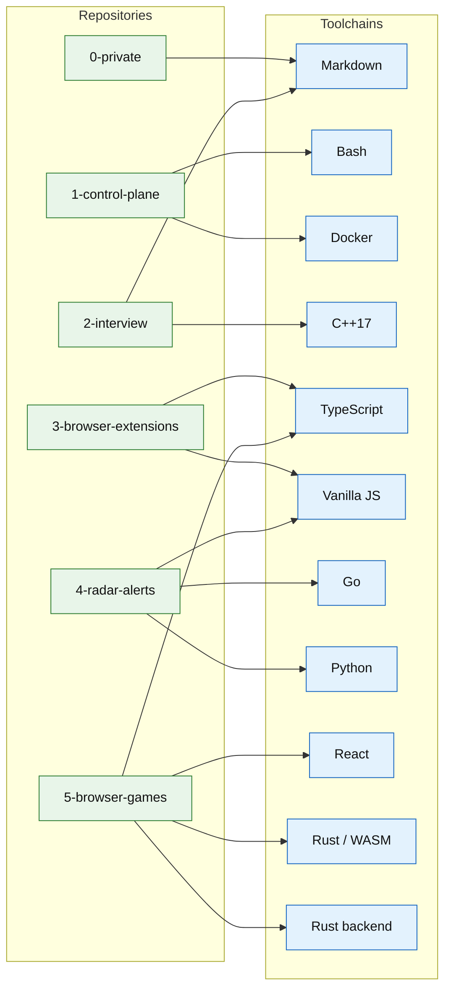

# Ecosystem — repo → tech map

**Parent:** [`README.md`](./README.md)

How the repositories relate to the toolchains they run on. Every language is the best tool for its job — one toolchain per purpose, deliberately chosen.

## Repo → tools

| Repo | Tools | Why |
|---|---|---|
| 0-private | Markdown · PDF · images | Heavy note-taking vault — content as plain text, versionable and diffable. |
| 1-control-plane | Bash · Docker · YAML · Markdown | The shell is the interface; one pinned docker image per toolchain. |
| 2-interview | Markdown · C++17 · LaTeX · Mermaid | Interview prep — notes + CP baseline + resume; mermaid for architecture. |
| 3-browser-extensions | TypeScript · Vanilla JS · Vite | Typed JS for the browser runtime, ships without a server. |
| 4-radar-alerts | Go · Python · Vanilla JS · Docker Compose | Go for the pipeline, Python for scraping, plain JS for the static UI. |
| 5-browser-games | Rust/WASM · Rust backend · React · TypeScript · Tailwind | One Rust codebase from engine (WASM) to backend; React where a SPA earns it. |
